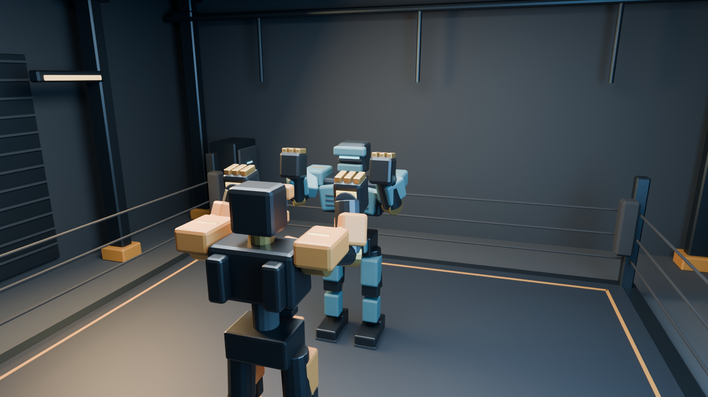
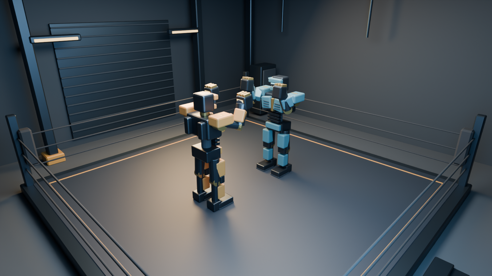
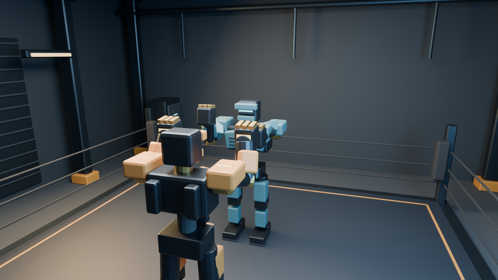

# Арена и камера — графическая поставка 0.4

Дата: 2026-10-02. Codex создал оригинальную компактную арену и проверяемую сцену Blender 4.5.7 LTS. Это исходники окружения и offline lookdev. Импорт Unreal, игровой свет и камера в движении ещё не проверены.

## Результат

Ринг с тёмным настилом и окрашенной границей, четыре угловые стойки, 12 тросов, платформа и сервисные ступени. Вокруг — крупные колонны, ворота, трубы, шкафы и световые полосы. Пол 12×12 м, настил 6.4×6.4 м. Геометрия окружения: **4 180 треугольников, 2 280 вершин, 8 material slots, 1 UV channel**. Роботы и освещение в статический FBX не экспортируются.

Источник: ArtSource/Blender/Arena/industrial_arena.blend. Экспорт: ArtSource/exports/arena/industrial_arena.fbx. Сцена содержит оба текстурированных робота в стойке, собственные материалы, три area lights и камеру обзора. Их данные берутся из поставок 0.1/0.3; исходные десять robot/animation FBX не менялись.





Материалы арены — собственные PBR-параметры и Blender noise для микронормали. Скрипт Unreal переносит палитру/metallic/roughness/эмиссию простыми material instances, но не переносит Blender noise. Сведение внешнего вида двух рендереров требует реального lookdev в движке.

## Камера

Ранний низкий ракурс закрывал голову противника роботом игрока. Камера смещена и поднята; общий ракурс перенесён внутрь зала, чтобы стена не попадала перед объективом. Финальные offline параметры находятся в arena_manifest.json:

| Параметр | Значение в системе Blender |
|---|---|
| Камера боя, метры | (-3.5, -1.4, 2.8) |
| Точка взгляда, метры | (1, 0, 1.55) |
| Lens / sensor width | 23.5 / 36 мм; горизонтальный FOV около 75° |
| Vanguard | (-1,0,0), yaw +90° |
| Bulwark | (1,0,0), yaw -90° |
| Общий ракурс | (-4.3,-4.3,3.5), цель (0,0,1.05), lens 24 мм |

Это фиксированная композиция на расстоянии двух метров между origins роботов. Она **не является** проверенным runtime follow controller. Значения существующего source-only IEVisualCameraRig не были подменены этими мировыми координатами: его follow anchor и spring-arm работают иначе. Оси и сантиметры Unreal проверить после импорта; не копировать Blender XYZ в движок без преобразования и проверки.

verify_arena_review.py проверяет 17 случаев: guard, прямые удары обеими руками до/на/после пика и оба уклона; по очереди у игрока и соперника. Sparse vertex rays измеряют попадание первого луча в соответствующую bone group, попадание в игрока и положение в кадре. Эти доли не измеряют видимую площадь в пикселях и не подтверждают читаемость боя.



Голова и обе руки находятся внутри безопасного кадра в проверяемых случаях. На пике удара есть частичное перекрытие защитой игрока; игровую приёмку камеры оставляем открытой. На Windows нужны одновременные действия, разные дистанции, реальное следование, препятствия, уклоны, FOV/aspect ratios, HUD и tracking. Выбор следующей коррекции делать по кадрам PIE, а не по этим статичным координатам.

## Воспроизведение на Blender

Из корня репозитория, подставив установленный Blender executable:

```powershell
& $BlenderExe --background --factory-startup --python-exit-code 1 --python Tools/Blender/build_arena_review.py -- --package .
& $BlenderExe --background --factory-startup --python-exit-code 1 --python Tools/Blender/verify_arena_review.py -- --package .
python Tools/QA/verify_package.py
```

Генератор заново пишет только собственную arena .blend/FBX, manifest, report и три arena PNG. Не запускать его, пока другой автор меняет эту .blend. Камера в сохранённой сцене показывает общий план; переключить на параметры camera_preview для плечевого ракурса. Пакет использует относительные // image references; переносить всю ArtSource, а не одну .blend.

Отчёты: ARENA_SOURCE_REPORT.json — source stats/checksums, ARENA_QA_REPORT.json — actual round trip и camera diagnostics. Команда portable QA проверяет наличие/целостность файлов; она не заменяет Blender QA или UE build.

## Импорт Unreal на Windows

Сначала Opus открывает реальный Game/IronEcho.uproject и подтверждает editor Python по WINDOWS_START.md. Сохранить собственные изменения, остановить PIE и передать единственному Art автору право на запись. Из Python console редактора, после добавления Tools/Unreal/Art в sys.path:

```python
import import_arena_source
import_arena_source.main([])              # preflight, без импорта ассета
import_arena_source.main(['--apply'])     # первая запись Art assets
```

Повторная замена принадлежащего текущему Art автору mesh: main(['--apply','--replace']). Не выполнять эту команду поверх несогласованных правок другого автора. Новые material instances создаются, уже существующие сохраняются. Preflight тоже пишет служебный JSON в Saved/IronEchoArtReports.

Скрипт использует классический FbxFactory, проверяет SHA256, API/options и material specs, импортирует /Game/Art/IronEcho/Arena/SM_IE_IndustrialArena, проверяет размеры в сантиметрах, UV, slots, отсутствие simple collisions и Nanite. Nanite, auto collision и lightmap UV generation запрошены выключенными. При сохранённых настройках повторного импорта проверяется фактический mesh; скрипт остановится при несовпадении. Привязанные MI_IE_Arena_* используют простой M_IE_Surface. Скрипт не меняет карту, Config, .uproject или gameplay.

В отдельной карте Art автор ставит mesh с transform origin/scale=1 и проверяет ворота/положение ринга/оси относительно бойцов. Не накладывать её геометрию на старый primitive sandbox. При необходимости нового арт-уровня сделать собственную карту и оформить передачу Opus. Для игрового уровня нужны отдельный collision floor/bounds и авторитетные правила Opus; автоматическая convex collision на всей комнате перекроет внутреннее пространство.

Источники API: [FbxStaticMeshImportData 5.6](https://dev.epicgames.com/documentation/en-us/unreal-engine/python-api/class/FbxStaticMeshImportData?application_version=5.6), [StaticMesh 5.6](https://dev.epicgames.com/documentation/en-us/unreal-engine/python-api/class/StaticMesh?application_version=5.6), [StaticMeshEditorSubsystem 5.6](https://dev.epicgames.com/documentation/en-us/unreal-engine/python-api/class/StaticMeshEditorSubsystem?application_version=5.6). Проверка документации не означает успешный импорт; установленную версию UE ещё нужно определить. При ошибке не переключаться молча на другой importer, а исправить конкретный API и сохранить фактический отчёт.

## Открытая приёмка

Комната сведена в один mesh для первой переносимой арт-поставки: это ещё не модульное окружение с независимым culling/LOD, collision или baked lighting. Один UV layout не следует считать подготовленными lightmap UV. Три lights в Cycles не доказывают цену UE lights; начать с одного основного shadow light и недорогого fill, затем измерить качество и frame time. Материалы/свет/камера должны быть проверены вместе с реальным боем, трекингом и packaged build на RTX 3050. FPS, VRAM и графическая готовность к Steam ещё не подтверждены.
