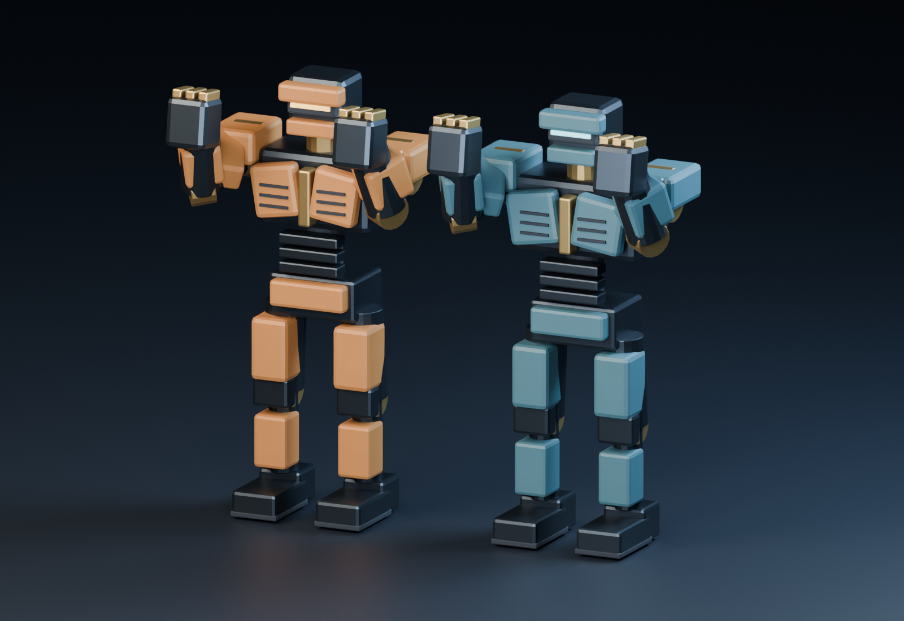

# IRON ECHO

Оригинальный бокс роботов с управлением движениями человека через камеру. Unreal Engine + Blender + MediaPipe. Codex отвечает за графику; Claude Opus 5.5 — за технический проект, трекинг, игровой бой, интеграцию и сборки.

**Последняя графическая поставка — 0.3:** запечённые PBR-текстуры и две облегчённые модели каждого бойца. Они созданы и проверены в Blender 4.5.7 LTS. Исходники UMG/камеры/VFX 0.2-draft и editor-скрипты Unreal подготовлены, но **в движке ещё не запускались**. .uproject, MediaPipe runtime и законченного боя в репозитории пока нет.



## Продолжение на Windows

```powershell
git clone https://github.com/sNibaAdeka/iron-echo.git
cd iron-echo
```

Репозиторий приватный: Git должен быть авторизован в аккаунте владельца. При установленном GitHub CLI можно использовать gh auth login и gh repo clone sNibaAdeka/iron-echo. Пароль и токен не надо отправлять в чат.

Открой папку в локальном агенте. Прочитай [AGENTS.md](AGENTS.md), [WINDOWS_START.md](WINDOWS_START.md), общий [PROJECT_STATE.md](PROJECT_STATE.md) и **последний [статус Codex](Docs/Handoffs/Codex/STATUS.md)**. PROJECT_STATE отражает предыдущую интеграционную точку; после приёма новой передачи его ведёт Opus. Не начинай выбор концепции заново.

На Windows Unreal уже установлен по сообщению владельца; реальные версия, toolchain и VRAM ещё не определены. Сначала подтвердить базовый импорт и скелет, затем материалы/LOD и runtime plugin. Подготовленные asset/presentation contracts остаются drafts до проверки Opus в UE.

## Создано и проверено

- Vanguard и Bulwark: реальные .blend/FBX, общий скелет из 20 костей и 5 материальных слотов.
- Восемь animation FBX: Idle, Guard, Straight_L/R, Dodge_L/R, HitReact, KO; прежние 50 проверок Blender.
- LOD0/1/2: **9432 / 5658 / 3300** triangles на каждого бойца.
- Шесть собственных PBR PNG 2048²: BaseColor, ORM и tangent Normal на каждого робота.
- Дополнение 0.3: **84/84 проверок Blender**, включая FBX round trips, жёстких весов и положений суставов, UV и внешних ссылок на текстуры.
- Три новых offline Blender renders: материалы и два LOD comparisons.
- UI-источники: семантическая тема,9 SVG-иконок, 6 макетов; offline contrast/layout/icon checks 17/6/9.

Это проверки ассетов и источников, а не подтверждение FPS, UMG, IK или camera tracking в игре. Модели остаются первой технической художественной итерацией; качество крупной студии не заявлено.

## Файлы

| Папка | Содержимое |
|---|---|
| ArtSource/Blender | Базовые модели, LOD и textured lookdev scenes |
| ArtSource/exports | Base FBX, 8 animation FBX, 4 LOD FBX и manifests |
| ArtSource/Textures/robots | 6 PBR PNG и texture manifest |
| ArtSource/UI | Тема, SVG icons и UI mockups |
| Tools/Blender | Воспроизводимые генераторы, bake, render и actual Blender QA |
| Tools/Unreal/Art | Prepared import/validate/arena/quality editor scripts |
| IntegrationDraft/IronEchoVisuals | Нативные UMG menu/HUD, shoulder camera и cosmetic impacts; C++ build unverified |
| Docs/Art | Направление, инструкции и фактические отчёты |
| Docs/Contracts | Черновой визуальный контракт |
| Docs/Handoffs/Codex | Последний статус и передачи интегратору |
| Docs/Briefs | Большой промт, разделение работы и стартовые задания |

Интеграция 0.3: [SURFACE_LOD_GUIDE.md](Docs/Art/SURFACE_LOD_GUIDE.md) и [передача Opus](Docs/Handoffs/Codex/surface-lods.md). Runtime 0.2: [README плагина](IntegrationDraft/IronEchoVisuals/README.md). У бинарных файлов один автор в момент записи.

## Проверка без Unreal

```powershell
python Tools/QA/verify_package.py
python Tools/UI/verify_ui.py
python Tools/UI/generate_runtime_theme.py --check
```

Проверка Blender 0.3 и воспроизведение изображений описаны в SURFACE_LOD_GUIDE. OpenGL normals требуют Unreal Flip Green Channel=true; ORM AO намеренно1. LOD снижает геометрию, но сохраняет 5 sections и сам по себе не гарантирует меньшие draw calls или нужный FPS.

## Следующие проверки

Unreal centimetres/+X-forward, skeleton/socket offsets, imported clips, tangents/LOD transitions, materials/mips/cook; затем принятые gameplay adapters и C++ build. Далее actual UMG/IK/camera/VFX, остальные экраны, выход бойцов и packaged Windows с реальным FPS/VRAM на RTX 3050. Эти проверки пока не выполнены.

Модели, материалы и иконки созданы собственными генераторами. Сторонние платные ассеты не покупались; объекты и материалы чужих франшиз не использованы.
