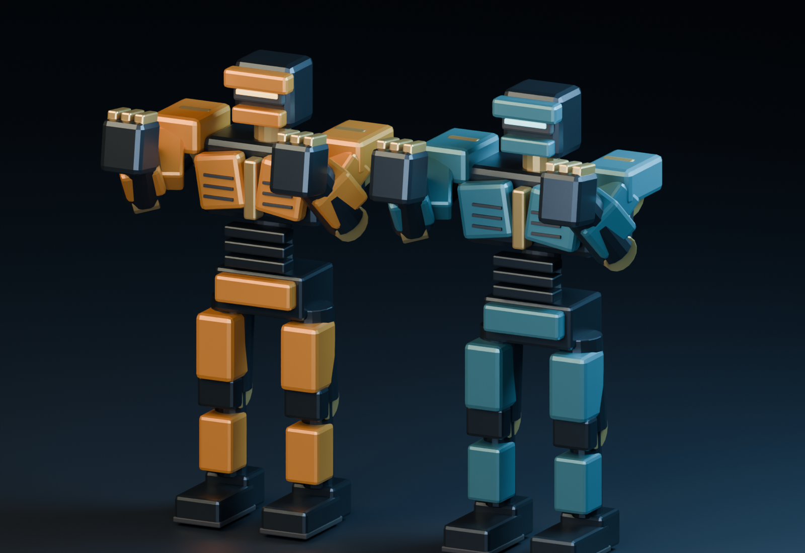

# IRON ECHO

Игра о боксе оригинальных роботов с управлением движениями человека через камеру. Unreal Engine + Blender + MediaPipe. Репозиторий предназначен для совместной разработки Codex и Claude Opus 5.5 на Windows-ПК владельца.

**Текущее состояние:** подготовлена первая графическая итерация. Две модели, общий скелет, восемь FBX-анимаций и UI-макеты созданы и проверены в Blender. Unreal-проект, gameplay и MediaPipe-интеграция ещё не созданы в этом репозитории. Скрипты Unreal подготовлены, но не запущены в движке.



## Продолжение на Windows

```powershell
git clone https://github.com/sNibaAdeka/iron-echo.git
cd iron-echo
```

Репозиторий приватный. Git должен быть авторизован в аккаунте владельца; пароль или токен не надо отправлять в чат. При установленном GitHub CLI можно пройти `gh auth login` на самом Windows-ПК и клонировать через `gh repo clone sNibaAdeka/iron-echo`.

Открой клонированную папку в локальном агенте и начни с [WINDOWS_START.md](WINDOWS_START.md), [PROJECT_STATE.md](PROJECT_STATE.md) и [AGENTS.md](AGENTS.md). Общий замысел и задания обеим моделям находятся в [Docs/Briefs](Docs/Briefs).

Codex отвечает за графику и визуальные ассеты. Opus создаёт технический проект, MediaPipe, правила боя, бота и сборку. Черновой визуальный контракт требует проверки Opus до подключения gameplay.

## Что находится в репозитории

| Папка | Содержимое |
|---|---|
| ArtSource/Blender | Реальные .blend двух роботов и презентационной сцены |
| ArtSource/exports | Skeletal FBX, восемь animation FBX и manifest |
| ArtSource/UI | Тема, SVG-иконки и макеты меню/HUD |
| Tools/Blender | Генератор моделей и Blender round-trip проверки |
| Tools/Unreal/Art | Подготовленные import/validate/arena editor-скрипты |
| Tools/UI | Генератор UI-источников и проверки доступности |
| Docs/Art | Направление, отчёты Blender и UMG-спецификация |
| Docs/Contracts | Черновой контракт скелета, анимаций и сокетов |
| Docs/Handoffs/Codex | Передача визуальной части Opus |
| Docs/Briefs | Большой промт и разделение работы |

Бесплатная локальная проверка файлов без Unreal:

```powershell
python Tools/QA/verify_package.py
python Tools/UI/verify_ui.py
```

Проверки этих команд не подтверждают runtime игры или FPS на RTX 3050. Подробности визуального пакета приведены ниже; актуальный статус продолжения — в PROJECT_STATE.md.

---

## Первый визуальный пакет Codex

Это реальные процедурные 3D-ассеты и подготовленная автоматизация редактора, а не готовая игра. Два робота, общий скелет, восемь анимационных FBX, графические исходники и UI-макеты созданы. Unreal не установлен в среде подготовки; его скрипты ещё не запускались в движке. Windows, управление камерой, runtime IK и FPS на RTX 3050 не проверены.

## Что уже проверено

- Blender 4.5.7 LTS: генерация обеих моделей и реальный FBX-экспорт.
- По 9432 треугольника, 4864 вершины, 20 костей и пять слотов материалов на робота.
- Высота в исходной позе — 2.1485 м. Каждый vertex имеет один rigid bone weight; непривязанных вершин нет.
- 50/50 проверок: веса, UV, направление движения кулаков, отсутствие растяжения цепей, отсутствие root motion, FBX round-trip и длительности клипов.
- UI-источники: 17/17 пар контраста, 6/6 компоновок и 9/9 SVG-иконок. Это SVG-макеты и UMG-спецификация, не работающие UMG Widgets.

Отчёты: Docs/Art/BLENDER_BUILD_REPORT.json, BLENDER_QA_REPORT.json и ArtSource/UI/contrast_report.json.

## Запуск на твоём Windows-ПК с установленным Unreal

1. Распакуй весь пакет в стабильную папку, например `D:\Games\IronEchoVisuals`. Не переносить отдельно папку Tools: она использует относительный manifest.
2. Opus создаёт или открывает технический проект IronEcho; этот пакет не меняет `.uproject`, gameplay или Config.
3. В Unreal включи Python Editor Script Plugin и Editor Scripting Utilities, затем перезапусти редактор.
4. Сохрани уровень и остальные изменения; останови Play In Editor. Другой агент не должен писать в эту же рабочую копию.
5. Выбери File → Execute Python Script и укажи `Tools\Unreal\Art\run_art_setup.py` из распакованного пакета.
6. При поддерживаемом API скрипт импортирует двух роботов и клипы, проверит данные и создаст карту `/Game/Art/IronEcho/Arena/L_IE_ArtSandbox`.
7. Результаты исполнения появятся в `Saved\IronEchoArtReports` твоего Unreal-проекта. Сохрани их для разбора реальных ошибок.

API-основа подготовленных скриптов — классический FBX importer Unreal 5.6. Совместимость с установленной у тебя версией не подтверждена. Если движок сообщает о недоступном свойстве или importer, нужна адаптация под его версию; скрипт не должен молча считать импорт успешным.

Если Fist_L/R нельзя создать через Python этой версии, их нужно добавить в Skeleton Editor на hand_l/r и повторить проверку. Это предварительные нулевые offsets: игровой контактный центр должен отдельно проверить Opus.

Повторный запуск не перезаписывает готовые ассеты автоматически. Для исправлений сначала передать право записи, затем явно использовать `--replace` в соответствующем скрипте или создать новую sandbox-карту. Не удалять чужие ассеты для обхода проверки.

## Передача Opus

Дай Opus этот пакет, robot-boxing-master-prompt.md и robot-boxing-team-plan.md. Контракт находится в `Docs/Contracts/ROBOT_VISUAL_CONTRACT_DRAFT.md` и требует его принятия до gameplay-интеграции.

Попроси выполнить сначала импорт и сохранить отчёты. После реального импорта проверить сантиметры, +X-forward, стороны рук, Skeleton, материальные слоты и анимации. Дальше подключать позу MediaPipe и события подтверждённого попадания к визуальной части.

Codex отвечает за дальнейшие графические исправления; Opus — за технический проект и авторитетные игровые правила. SVG-макеты не подменяют разработку UMG, а sandbox-камера не подменяет runtime camera controller.

## Воспроизводимость Blender

```text
blender --background --factory-startup --python Tools/Blender/build_robots.py -- --package . --quick-render
blender --background --factory-startup --python Tools/Blender/verify_robots.py -- --package .
```

Генератор создаёт свои выходные `.blend`, `.fbx`, manifest и preview; запускать его из этого пакета, а не поверх чужих исходников. Для корректной сравнимости использовать подтверждённую версию Blender 4.5.7 либо отдельно проверить новую версию.

## Ограничения первого пакета

- Модели — первая техническая итерация промышленного силуэта; качество большой студии не заявлено.
- LOD-модели, работающий IK solver, runtime VFX и UMG ещё не реализованы.
- KO — упрощённая реакция корпусом, не падение и не ragdoll.
- Blender procedural noise не переносится напрямую через FBX; Unreal-скрипт создаёт упрощённые PBR-материалы.
- WearAmount изменяет материал целиком; локальные следы каждого удара требуют дополнительной реализации.
- Основная карта, свет и камеры здесь существуют как скрипты генерации, а не как проверенные `.uasset/.umap`.
- Preview robots-studio.png — реальный Blender-рендер моделей, не скриншот игры.

## Источники API

- [Blender FBX export](https://docs.blender.org/api/4.5/bpy.ops.export_scene.html).
- [Редакторский Python Unreal](https://dev.epicgames.com/documentation/en-us/unreal-engine/scripting-the-unreal-editor-using-python).
- [SkeletalMesh Python API 5.6](https://dev.epicgames.com/documentation/en-us/unreal-engine/python-api/class/SkeletalMesh?application_version=5.6).

Внешние 3D-модели, платные ассеты и материалы чужих франшиз не использованы. Иконки и модели процедурно созданы в этом пакете; используемые Blender/Unreal имеют собственные условия лицензирования.
